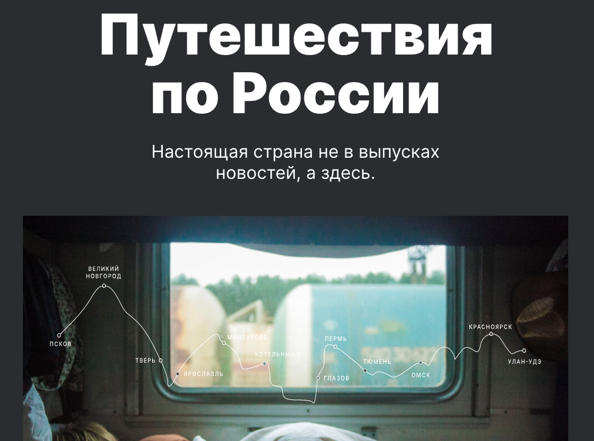

# Проект: Путешествие по России

### Обзор
* Интро
* Технические особенности
* Ссылка на сам проэкт

**Интро**

Этот проект о путешествии по России.
В нем будет расказыватся о различных красивых местах России. Поситив их вы врятле останитесь равнодушным. Проэкт сопровождается множеством иллюстраций, что в свою очередь осставляет приятное впечатление о проекте.

В проекте рассказывается о таких местах как:
  * Куршская коса
  * Кольский полуостров
  * Алтай
  * Зимний Байкал

**Технические особенности**

* Тайт создан в современном темном стиле.
* Применен эфект прозрачности при навидении мышью на ссылки.
* Проект полностью адаптирован под мобильные устройства

[Ссылка на сайт](https://000ren000.github.io/russian-travel/)

